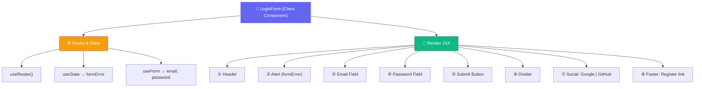
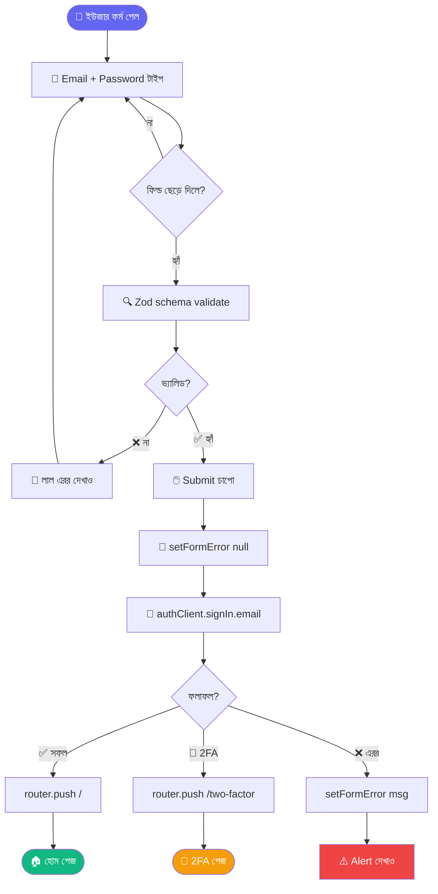
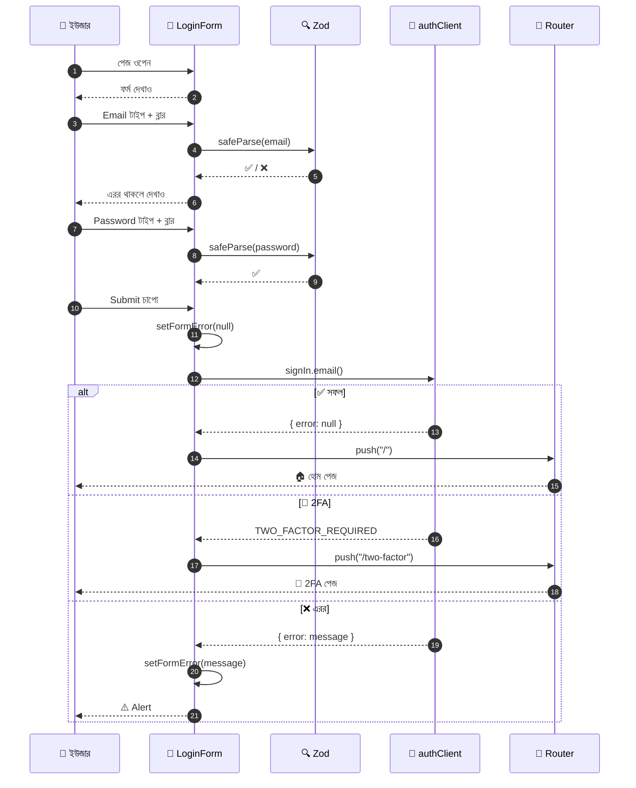
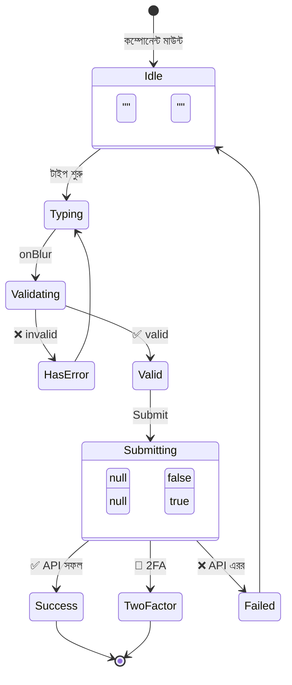
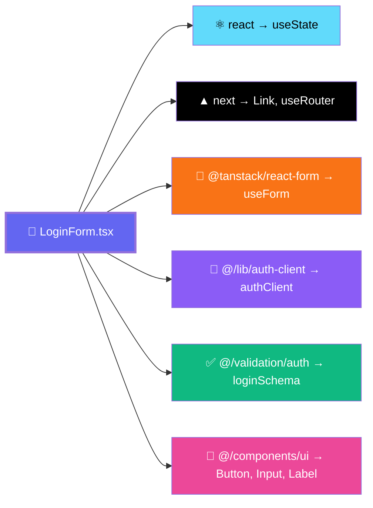

# 🔐 LoginForm — Documentation

> **File:** `components/auth/login-form.tsx`
> **Type:** Client Component
> **Last Updated:** 2026-09-23

---

## 📌 সংক্ষিপ্ত পরিচিতি

`LoginForm` হলো Evalora অ্যাপের **লগইন এন্ট্রি পয়েন্ট**। এটি ইউজারকে **Email + Password** অথবা **Google / GitHub** দিয়ে লগইন করতে দেয়।

### 🎯 দায়িত্বসমূহ
- ✅ Email/Password ভ্যালিডেশন (Zod দিয়ে)
- ✅ Credentials দিয়ে লগইন API কল
- ✅ 2FA ফ্লো হ্যান্ডল করা
- ✅ সোশ্যাল লগইন সাপোর্ট
- ✅ Accessible error messages

---

## 🗺️ কম্পোনেন্ট ম্যাপ

---

## 🔄 লগইন ফ্লো (Flowchart)

---

## 🎬 Sequence Diagram

---

## 🔀 State Diagram

---

## 🧱 Dependency Tree

---

## 📊 State Reference

| State | Type | Initial | Purpose |
|-------|------|---------|---------|
| `formError` | `string \| null` | `null` | API থেকে আসা গ্লোবাল এরর |
| `email` | `string` | `""` | TanStack Form value |
| `password` | `string` | `""` | TanStack Form value |
| `isSubmitting` | `boolean` | `false` | Submit লোডিং স্টেট |

---

## 🔗 API Endpoints Used

| Method | Endpoint | Purpose |
|--------|----------|---------|
| `authClient.signIn.email()` | POST `/auth/sign-in/email` | Credentials লগইন |
| `authClient.signIn.social()` | POST `/auth/sign-in/social` | OAuth লগইন |

---

## 🛣️ Navigation Routes

| Trigger | Destination |
|---------|-------------|
| ✅ সফল লগইন | `/` (হোম) |
| 🔐 2FA দরকার | `/two-factor` |
| 🔗 Forgot password | `/forgot-password` |
| 🔗 Register | `/register` |

---

## 🧪 Test Cases (Flowchart থেকে নেওয়া)

| # | Scenario | Expected Result |
|---|----------|-----------------|
| 1 | Empty email submit | "Email is required" error |
| 2 | Invalid email format | "Invalid email" error |
| 3 | Empty password | "Password is required" error |
| 4 | Wrong credentials | Alert with error message |
| 5 | Valid + no 2FA | Redirect to `/` |
| 6 | Valid + 2FA on | Redirect to `/two-factor` |
| 7 | Google button | OAuth flow start |
| 8 | GitHub button | OAuth flow start |

---

## ⚠️ Error Codes

| Code | Handling |
|------|----------|
| `TWO_FACTOR_REQUIRED` | `/two-factor` এ রিডাইরেক্ট |
| (অন্য যেকোনো) | `formError` state-এ দেখাও |

---

## ♿ Accessibility Features

- ✅ `role="alert"` — formError এর জন্য
- ✅ `aria-invalid` — ভুল ফিল্ডে
- ✅ `aria-describedby` — এরর মেসেজের সাথে লিংক
- ✅ `autoComplete` — browser autofill সাপোর্ট
- ✅ `noValidate` — browser default বন্ধ, Zod ব্যবহার

---

## 🚀 ভবিষ্যতের Extension Points

কোথায় নতুন ফিচার যোগ করবেন:

| ফিচার | কোথায় পরিবর্তন |
|-------|----------------|
| 📧 Magic Link | `onSubmit` এ নতুন branch |
| 📱 OTP | `onSubmit` এর `TWO_FACTOR_REQUIRED` এর পাশে |
| 🍎 Apple Sign-in | Social grid এ নতুন Button |
| 🔑 Remember Me | নতুন `form.Field` + cookie logic |

---

## 📝 Changelog

| Date | Change | Author |
|------|--------|--------|
| 2026-09-23 | Initial documentation | — |

---

## 🔗 Related Files

- `lib/auth-client.ts` — Better Auth ক্লায়েন্ট
- `validation/auth.ts` — Zod schemas
- `components/ui/button.tsx`
- `components/ui/input.tsx`
- `components/ui/label.tsx`
- `app/two-factor/page.tsx` — 2FA flow
- `app/forgot-password/page.tsx`
- `app/register/page.tsx`

---

## 💡 Tips for Future Developers

1. **নতুন error code যোগ করলে** → `onSubmit` এর `if (error)` ব্লকে নতুন case দিন
2. **নতুন social provider যোগ করলে** → social grid এ নতুন `<Button>` দিন
3. **Validation rule পরিবর্তন হলে** → `loginSchema` এডিট করুন, এই ফাইল নয়
4. **Redirect path বদলাতে হলে** → `router.push()` কল খুঁজুন